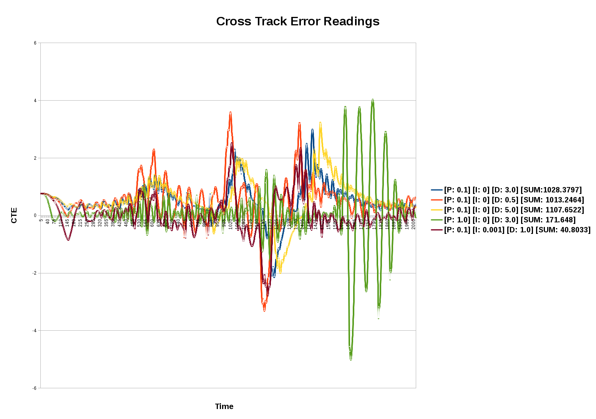

# Project Reflection

## Describe the effect each of the P, I, D components had in your implementation.

The Proportional component (P) of the PID Controller enabled me to calculate a base steering angle to guide my vehicle towards a reference trajectory to navigate the track.  Setting the proportional gain too high  resulted in the car making severely wide turns and jumping the lane curbs quickly, crashing into a ditch on the side of the road.  

Once a stable proportional gain value was determined, the vehicle would steer more gradually towards the reference trajectory and oscillated less initially.  However, the vehicle would gradually oscillate around the reference trajectory at an increasing rate and still ended up jumping the lane curbs and crashing into a ditch.  

Clearly, the P-component by itself was insufficient to navigate the track effectively.  To address this, adding the Differential component (D) helped offset the wild oscillations that were occurring.  D considers the cross track error rate and applies a differential gain, ultimately providing a steering angle that helped "smooth" out the vehicle's navigation for a more comfortable ride and reduced oscillation around the reference trajectory.  Setting a differential gain with a value that was too high would cause the vehicle to overcompensate too much when steering back into the reference trajectory.

The Integral component (I) of the PID controller is supposed to help the car recover in the case in which the car unexpectedly veers from the reference trajectory, such as a strong wind gust or running over a objects in the road.  The I-component did not have much effect for this particular project, which is to be expected, as there were no external forces that would cause the vehicle to veer from the reference trajectory.

## Describe how the final hyperparameters were chosen.

I chose my final hyperparameters, using manual tuning.  I randomly chose a few different values for P, I, and D and graphed the cross track error values that were captured as the vehicle made a lap around the track in the following chart:

Looking at the sum of the accumulated cross track errors in each test configuration, I determined that setting P = 0.1, I = 0.001, and D = 1.0  was ideal as the chart indicates that it allowed the car to follow the reference trajectory the closest with the most subtle oscillations, indicated by the low sum computed and graphed lines above.  This uses the default constant throttle value of 0.3 from the starter code for this project, resulting in a top speed of about 35 mph.

I wanted to see how fast I could get the vehicle to navigate the track, and proceeded to tweak the PID values accordingly.  I managed to achieve a top speed of 75 mph, but decided to throttle this down as the oscillations were more pronounced than the values I ended up using for this submission, in which the top speed achieved is 55 mph.  In order to reach this higher speed, I dynamically set the throttle value so that when the steering angle received from the simulator is greater than 0.35 radians, the throttle is set to 0.0 much like a normal human driver would do when turning the steering wheel into a curve.  When going straight, the throttle is set to 0.65.

My final PID values are:  P = 0.098, I = 0.0, and D = 1.33.